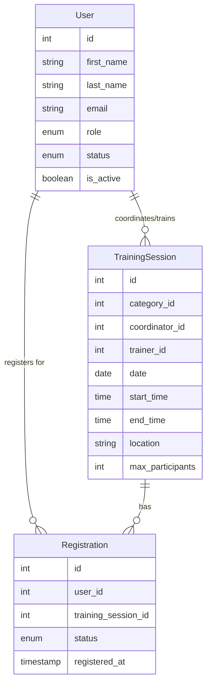

# MySkills

<p align="center">
  
</p>

<p align="center">
  <strong>A comprehensive full-stack platform for managing skills training and development</strong>
</p>

<p align="center">
  <a href="#-quick-start">Quick Start</a> •
  <a href="#-features">Features</a> •
  <a href="#-tech-stack">Tech Stack</a> •
  <a href="#-api-documentation">API</a> •
  <a href="#-contributing">Contributing</a>
</p>

<p align="center">
  
  
  
  
</p>

---

## 📋 Overview

MySkills is a modern, full-stack web application designed to streamline the management of skills training programs. Built with Laravel and React, it provides a comprehensive solution for educational institutions and training organizations to manage courses, sessions, user progress, and analytics.

**🗓️ Project Timeline**: June 26 - August 6, 2025 (6 weeks)  
**🏢 Context**: Esprit Summer Internship Project 2025  
**🚀 Current Status**: Active Development

### 🎯 Core Mission

Empower organizations to efficiently manage their training ecosystem with role-based access, automated workflows, and comprehensive analytics.

---

## ✨ Features

### 🔐 Authentication & Authorization

- **Multi-role authentication** (Admin, Coordinator, Trainer, Trainee)
- **Secure password reset** via email
- **Profile management** with image upload
- **Role-based access control** with granular permissions

### 📚 Training Management

- **Category-based organization** of training sessions
- **Course and session creation** with rich content support
- **Registration workflow** with approval/rejection system
- **Attendance tracking** and progress monitoring
- **Certificate generation** upon completion

### 🎨 Modern User Experience

- **Glassmorphism UI design** with animated elements
- **Responsive dashboards** tailored for each user role
- **Real-time notifications** system
- **Interactive feedback** and rating system

### 📊 Analytics & Reporting

- **Comprehensive analytics** for administrators
- **Progress tracking** for trainees and trainers
- **Performance metrics** and completion rates
- **System health monitoring**

---

## 🛠️ Tech Stack

### Backend

- **Framework**: Laravel 12 (PHP 8.2+)
- **Authentication**: Laravel Sanctum
- **Database**: MySQL 8.0 / SQLite
- **Image Processing**: Intervention Image
- **Email**: SMTP with Gmail integration
- **Testing**: PHPUnit

### Frontend

- **Framework**: React 18.3 with Vite
- **UI Library**: Ant Design + Tailwind CSS
- **HTTP Client**: Axios
- **Routing**: React Router DOM
- **State Management**: React Context API
- **Media**: React Player, React YouTube

### External Services

- **Image Storage**: [ImgBB API](https://api.imgbb.com/)
- **Email Service**: SMTP (Gmail)
- **Build Tools**: Vite, Composer, npm

---

## 👥 User Roles & Permissions

<table>
  <thead>
    <tr>
      <th>Role</th>
      <th>Key Permissions</th>
      <th>Primary Functions</th>
    </tr>
  </thead>
  <tbody>
    <tr>
      <td><strong>🔑 Admin</strong></td>
      <td>Full platform access</td>
      <td>User management, system settings, analytics, CRUD operations</td>
    </tr>
    <tr>
      <td><strong>📋 Coordinator</strong></td>
      <td>Session & registration management</td>
      <td>Create sessions, assign trainers, approve registrations, monitor progress</td>
    </tr>
    <tr>
      <td><strong>👨‍🏫 Trainer</strong></td>
      <td>Course & attendance management</td>
      <td>Create courses, manage content, track attendance, provide feedback</td>
    </tr>
    <tr>
      <td><strong>👨‍🎓 Trainee</strong></td>
      <td>Learning & participation</td>
      <td>Enroll in sessions, attend courses, submit feedback, track progress</td>
    </tr>
  </tbody>
</table>

---

## 🚀 Quick Start

### Prerequisites

- **PHP** 8.2 or higher
- **Composer** 2.0+
- **Node.js** 18+ and npm
- **MySQL** 8.0 or SQLite
- **Git**

### Backend Setup

```bash
# Clone the repository
git clone <repository-url>
cd MySkills/backend

# Install PHP dependencies
composer install

# Environment setup
cp .env.example .env
# Edit .env with your database and email configuration

# Generate application key
php artisan key:generate

# Run migrations and seed data
php artisan migrate --seed

# Install and build frontend assets
npm install && npm run dev

# Start the development server
php artisan serve
```

Your API will be available at `http://localhost:8000`

### Frontend Setup

```bash
# Navigate to frontend directory
cd ../frontend

# Install dependencies
npm install

# Start development server
npm run dev
```

Your application will be available at `http://localhost:5173`

### 🔧 Environment Configuration

#### Backend (.env)

```bash
# Database
DB_CONNECTION=mysql
DB_HOST=127.0.0.1
DB_PORT=3306
DB_DATABASE=myskills
DB_USERNAME=your_username
DB_PASSWORD=your_password

# Email Configuration
MAIL_MAILER=smtp
MAIL_HOST=smtp.gmail.com
MAIL_PORT=465
MAIL_USERNAME=your_email@gmail.com
MAIL_PASSWORD=your_app_password
MAIL_ENCRYPTION=ssl
MAIL_FROM_ADDRESS=your_email@gmail.com
MAIL_FROM_NAME="MySkills"

# Image Upload Service
IMAGEBB_API_KEY=your_imgbb_api_key
IMAGEBB_URL=https://api.imgbb.com/1/upload
```

---

## 📊 Project Status & Roadmap

- [x] **Analysis & Design** (Week 1)
- [x] **Backend Development** (Weeks 2-3)
- [x] **Frontend Development** (Weeks 4-5)
- [x] **Authentication & Notifications** (Complete)
- [x] **Password Reset System** (Complete)
- [ ] **Testing & Quality Assurance** (Week 6)
- [ ] **Documentation Finalization** (Week 6)

---

## 🏗️ Architecture Overview

### Project Structure

```
MySkills/
├── 📁 docs/                    # Documentation & specifications
│   ├── specifications/         # Project requirements
│   └── diagrams/              # UML & system diagrams
├── 🔧 backend/                 # Laravel API
│   ├── app/                   # Application logic
│   │   ├── Models/            # Eloquent models
│   │   ├── Http/Controllers/  # API controllers
│   │   └── Services/          # Business logic
│   ├── database/              # Migrations & seeders
│   └── routes/api.php         # API routes
├── 🎨 frontend/                # React application
│   ├── src/
│   │   ├── components/        # Reusable components
│   │   ├── pages/            # Application pages
│   │   ├── admin/            # Admin panel
│   │   ├── contexts/         # React contexts
│   │   └── services/         # API services
│   └── public/               # Static assets
└── README.md
```

### Core Models & Relationships



---

## 🔗 API Documentation

### Authentication Endpoints

| Method | Endpoint | Description |
|--------|----------|-------------|
| `POST` | `/api/auth/login` | User login |
| `POST` | `/api/auth/register` | User registration |
| `POST` | `/api/auth/logout` | User logout |
| `POST` | `/api/auth/forgot-password` | Password reset request |

### Core Resource Endpoints

| Resource | Endpoints | Description |
|----------|-----------|-------------|
| **Users** | `/api/users`<br>`/api/users/{id}`<br>`/api/users/{id}/deactivate`<br>`/api/users/{id}/ban`<br>`/api/users/profile`<br>`/api/users/change-password` | User management, profiles, deactivate/ban, profile & password update |
| **Categories** | `/api/categories`<br>`/api/categories/{id}`<br>`/api/categories/{category_id}/deactivate` | Training categories CRUD & deactivate |
| **Sessions** | `/api/training-sessions`<br>`/api/training-sessions/{id}` | Training sessions CRUD |
| **Courses** | `/api/training-courses`<br>`/api/training-courses/{id}` | Course content CRUD |
| **Registrations** | `/api/registrations`<br>`/api/registrations/{id}`<br>`/api/registrations/status/{sessionId}`<br>`/api/registrations/session/{sessionId}`<br>`/api/registrations/status/pending/{coordinatorId}`<br>`/api/registrations/user/{user}` | Session registrations, status, by session/user, pending |
| **Feedback** | `/api/feedbacks`<br>`/api/feedbacks/{id}` | User feedback CRUD |
| **Notifications** | `/api/notifications`<br>`/api/notifications/{id}` | System notifications CRUD |
| **Session Completion** | `/api/session-completions`<br>`/api/session-completions/{id}`<br>`/api/session-completions/{id}/mark-completed`<br>`/api/session-completions/{id}/generate-certificate`<br>`/api/registrations/{registrationId}/session-completion` | Session completion, mark as completed, generate certificate |
| **System Health** | `/api/health` | System health check |

### Example API Usage

**Create Training Session**

```bash
POST /api/training-sessions
Content-Type: application/json
Authorization: Bearer {token}

{
  "category_id": 1,
  "trainer_id": 2,
  "coordinator_id": 3,
  "date": "2025-07-20",
  "start_time": "09:00",
  "end_time": "12:00",
  "location": "Room 101",
  "max_participants": 20,
  "skill_name": "Excel Basics",
  "skill_description": "Introduction to Excel for business applications"
}
```

---

## 🧪 Testing

### Backend Tests

```bash
cd backend
php artisan test
```

### Frontend Linting

```bash
cd frontend
npm run lint
```

### Test Coverage

- **Unit Tests**: Model validation, service logic
- **Feature Tests**: API endpoints, authentication flows
- **Integration Tests**: Complete user workflows

---

## 🔧 Development Tools & Packages

### Backend Dependencies

- **Core**: Laravel Framework, Laravel Sanctum
- **Image Processing**: Intervention Image
- **Testing**: PHPUnit, Faker
- **Documentation**: Scribe API Documentation

### Frontend Dependencies

- **UI Framework**: React, Ant Design, Tailwind CSS
- **Utilities**: Axios, date-fns, React Router DOM
- **Media**: React Player, React YouTube
- **Development**: Vite, ESLint, PostCSS

---

## 📝 License

This project is developed as part of an academic internship program. Please contact the development team for licensing information.
